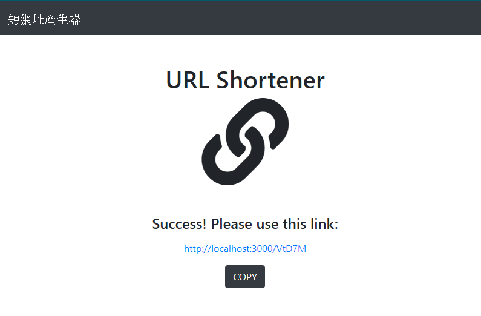

# 短網址產生器

# 功能描述
- 點下"Shorten"按鈕，即可產生短網址

# 環境建置與需求
- Node.js: v10.15.0
- Express: v4.17.1
- Express-Handlebars: v5.1.0
- body-parser: v1.19.0
- mongoose: v5.9.28

# 預覽畫面

# 安裝與執行步驟
1. 下載專案
> git clone https://github.com/ShengYaoHuang/url_shortener.git

2. 進入專案資料夾
> cd url_shortener

3.下載套件
> npm install

4. 執行程式
> npm run dev
